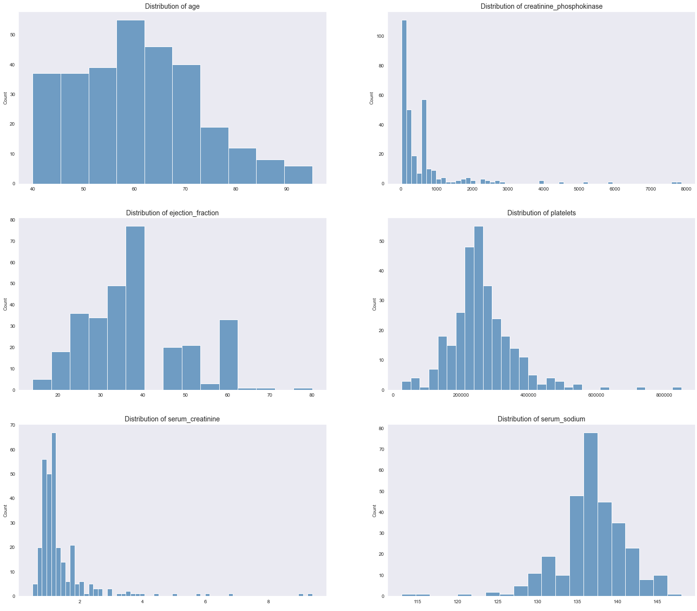

# Heart Failure Prediction

## Introduction and Objective

An estimated 17.9 million people died from Cardiovascular diseases CVDs in 2019, representing 32% of all global deaths. Of these deaths, 85% were due to heart attack and stroke.
Most cardiovascular diseases can be prevented by addressing behavioural risk factors such as tobacco use, unhealthy diet and obesity, physical inactivity and harmful use of alcohol.
It is important to detect cardiovascular disease as early as possible so that management with counselling and medicines can begin. 
Machine Learning algorithms can be applied in healthcare to adress these challenges and improve people lives.

## Data

To build this model and app, a dataset from [Kaggle](https://www.kaggle.com/andrewmvd/heart-failure-clinical-data) was used. What is special about this dataset?
It uses data already published in clinical and scientific magazines, thus, peer reviewed and compliant with ethical data methodology.

#### Aditional References

*Chicco, D., Jurman, G. Machine learning can predict survival of patients with heart failure from serum creatinine and ejection fraction alone. BMC Med Inform Decis Mak 20, 16 (2020). https://doi.org/10.1186/s12911-020-1023-5*

*Ahmad T, Munir A, Bhatti SH, Aftab M, Raza MA. Survival analysis of heart failure patients: a case study. PLoS ONE. 2017; 12(7):0181001.*

#### Basic Data Analysis

* There was no missing data
* This dataset contains data of 299 patients

## Used Packages

    import pandas as pd 
  import numpy as np 
  import matplotlib.pyplot as plt 
  import seaborn as sns 
  import missingno as msn

  from sklearn.model_selection import train_test_split
  from sklearn.preprocessing import StandardScaler
  from sklearn.model_selection import KFold
  from sklearn.ensemble import RandomForestClassifier
  from sklearn.linear_model import LogisticRegressionCV
  from sklearn.tree import DecisionTreeClassifier
  from sklearn.neighbors import KNeighborsClassifier
  from xgboost import XGBClassifier
  from sklearn.model_selection import cross_validate

  from sklearn.metrics import accuracy_score
  from sklearn.metrics import precision_score
  from sklearn.metrics import f1_score
  from sklearn.metrics import roc_curve
  from sklearn.metrics import roc_auc_score

  from sklearn.model_selection import RandomizedSearchCV
  from sklearn.model_selection import GridSearchCV
